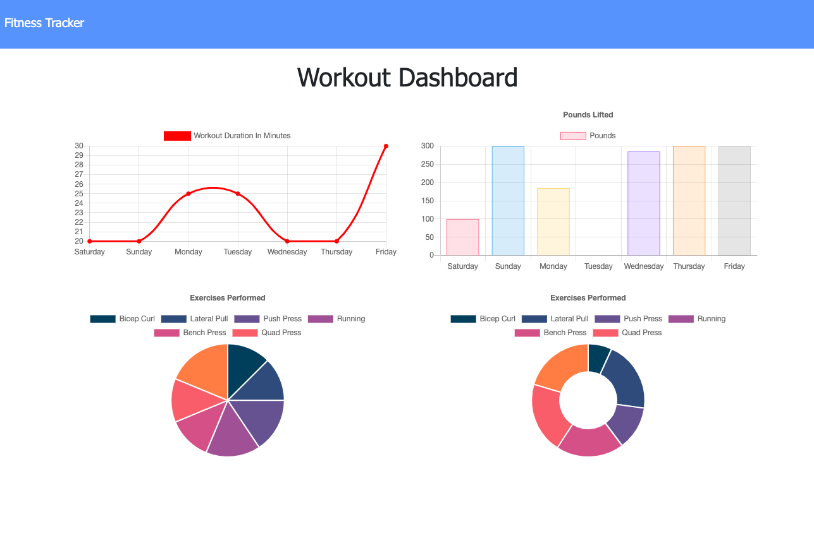

# workoutTracker

Workout tracker is an application using MongoDB to keep track of either cardio or resistance workouts.  As the user inputs new workouts, they are entered into the database where they are aggregated and the last 7 are shown.

To install 
    npm install

Deployed to Heroku: 

Questions:
GitHub Link: chefjaypeek

Screenshot: 